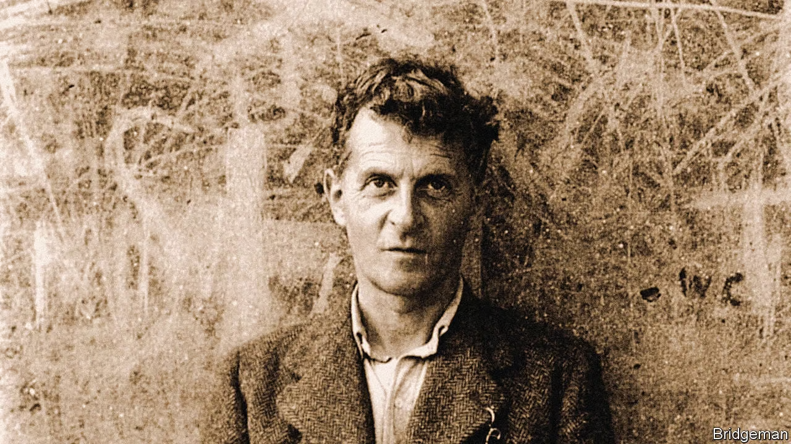

인류의 지적 여정은 끊임없는 도전과 혁명의 연속이었다. 우리는 언어를 통해 세상을 이해하고 지식을 축적해왔다. 하지만 지금, 우리는 새로운 위기와 기회의 갈림길에 서 있다. 언어의 한계가 드러나고, 인공지능이 우리의 지능 개념에 도전하며, 뇌과학의 발전이 의식과 이해의 본질에 대한 근본적인 질문을 제기하고 있다. 이 글에서 나는 이 복잡한 지형을 탐험하며, 우리의 '이해'라는 개념이 얼마나 견고한지, 그리고 미래의 지식과 의식은 어떤 모습일지 탐구해보고자 한다.

## 1. 언어의 감옥: 현실을 담지 못하는 그물

우리는 태어나면서부터 언어라는 렌즈를 통해 세상을 바라본다. 이 렌즈는 우리에게 세상을 이해하는 틀을 제공하지만, 동시에 우리의 인식을 제한한다. 마치 플라톤의 동굴 속 죄수들처럼, 우리는 언어라는 그림자만을 보며 그것이 전부라고 착각하고 있는 것은 아닐까?

양자역학을 예로 들어보자. 우리는 입자와 파동이라는 고전적 개념으로 양자 현상을 설명하려 한다. 하지만 이는 마치 3차원 물체를 2차원 그림자로 설명하려는 것과 다름없다. 슈뢰딩거의 고양이가 동시에 살아있으면서 죽어있다는 개념은 우리의 일상적 언어로는 표현 불가능하다. 이는 언어의 한계를 극명하게 보여주는 예다.

일상에서도 이러한 한계는 끊임없이 드러난다. "사랑"이라는 단어 하나로 우리는 얼마나 다양하고 복잡한 감정을 표현하려 하는가? 각자의 경험과 문화적 배경에 따라 그 의미는 천차만별이다. 우리는 같은 단어를 사용하면서도, 사실은 전혀 다른 의미 세계에 살고 있는 것이다.

이러한 언어의 한계는 단순히 의사소통의 문제를 넘어, 우리의 사고 자체를 제한한다. 언어가 없는 개념을 생각할 수 있을까? 사피어-워프 가설은 우리의 언어가 우리의 사고 방식을 결정한다고 주장한다. 만약 이것이 사실이라면, 우리는 언어라는 감옥에 갇혀 세상의 일부만을 보고 있는 것일지도 모른다.

## 2. AI의 도전: 이해 없는 지능의 역설

이러한 상황에서 인공지능의 등장은 우리에게 새로운 도전을 제시한다. 최신 AI 모델들은 놀라운 능력을 보여준다. GPT-3와 같은 언어 모델은 인간과 구분하기 어려울 정도로 자연스러운 텍스트를 생성한다. 알파고는 인간 최고의 바둑 기사를 압도적으로 이겼다. 이들은 분명 '지능적'으로 보인다. 하지만 이들에게 진정한 '이해'가 있다고 말할 수 있을까?

AI의 '지능'은 인간의 것과는 근본적으로 다르다. 인간의 지능이 의식적 경험과 불가분의 관계에 있다면, AI의 지능은 순수하게 패턴 인식과 확률적 예측에 기반한다. AI는 엄청난 양의 데이터를 처리하여 놀라운 결과를 만들어내지만, 그 과정에서 '이해'나 '의식'이라고 부를 만한 것은 존재하지 않는 것처럼 보인다.

이는 우리에게 중요한 질문을 던진다. '이해'란 과연 무엇인가? 만약 AI가 인간보다 더 정확하게 세상을 예측하고 반응할 수 있다면, 우리가 말하는 '이해'란 과연 필수적인 것인가? 어쩌면 우리가 자랑스럽게 여기는 '이해'라는 개념이 실은 인간 인지의 한계에서 비롯된 환상에 불과한 것은 아닐까?

더 나아가, AI의 작동 방식은 우리 자신의 사고 과정에 대해서도 의문을 제기한다. 딥러닝 모델의 내부 작동 원리는 '블랙박스'라 불린다. 우리는 그들이 어떻게 결론에 도달했는지 정확히 설명하지 못한다. 이는 우리 자신의 의사결정 과정과 얼마나 다를까? 우리도 종종 우리의 판단이나 감정의 정확한 이유를 설명하지 못한다. 어쩌면 우리의 '이해'라는 것도 복잡한 신경망의 출력에 불과한 것은 아닐까?

## 3. 미래의 지평: 뇌와 기계의 융합, 새로운 의식의 탄생

이러한 도전들 앞에서, 우리는 새로운 가능성을 모색해야 한다. 그 중 가장 흥미로운 것은 뇌와 기계의 직접적인 연결이다. 이는 단순한 공상과학적 아이디어가 아니다. 이미 Brain-Computer Interface (BCI) 기술은 빠르게 발전하고 있으며, 미래에는 이를 통해 뇌와 뇌, 또는 뇌와 AI를 직접 연결하는 것이 가능해질 수 있다.

이러한 기술은 두 가지 혁명적인 변화를 가져올 수 있다. 첫째, 우리는 언어라는 거친 의미 체계의 한계를 뛰어넘을 수 있다. 뇌와 뇌의 직접 연결을 통해 우리는 고차원의 의미 상태를 직접적으로 공유할 수 있게 될 것이다. 이는 마치 평생 흑백 세상에서 살던 사람이 갑자기 컬러 비전을 얻는 것과 같은 도약이 될 것이다. 우리의 사고와 이해의 스펙트럼이 갑자기 무한히 넓어지는 것을 상상해보라.

둘째, 인간의 신경망과 인공 신경망(ANN)의 직접적인 연결은 완전히 새로운 형태의 지능과 의식을 탄생시킬 수 있다. 우리는 AI의 패턴 인식 능력을 우리의 직관적 이해와 결합할 수 있게 될 것이다. 이는 단순히 우리의 지능을 확장하는 것을 넘어, 완전히 새로운 사고와 존재의 방식을 만들어낼 수 있다.

이러한 변화는 우리가 '이해'와 '의식'에 대해 가지고 있는 개념을 완전히 재정의하게 만들 것이다. 우리는 더 이상 개별적인 의식의 주체가 아니라, 거대한 네트워크의 한 노드로서 존재하게 될지도 모른다. 이는 두렵고 낯선 개념일 수 있지만, 동시에 인류 지성의 새로운 차원으로의 도약을 의미한다.

## 결론: 새로운 계몽의 시대를 향해

우리는 지금 인류 역사상 가장 중요한 지적 혁명의 기로에 서 있다. 언어의 한계를 인식하고, AI의 도전을 받아들이며, 뇌와 기계의 융합을 준비하는 것은 단순한 기술적 진보가 아니다. 이는 우리가 '앎'과 '존재'에 대해 가지고 있는 근본적인 개념을 재정립하는 과정이다.

이 여정은 불확실하고 때로는 두려울 수 있다. 우리는 익숙한 개념과 편안한 확신을 뒤로하고, 완전히 새로운 존재 방식을 탐험해야 할 것이다. 하지만 이는 동시에 인류에게 주어진 가장 흥미진진한 모험이기도 하다.

우리는 이 도전을 회피하거나 무시해서는 안 된다. 대신 우리는 이를 정면으로 마주하고, 적극적으로 탐구해야 한다. 그 과정에서 우리는 지금까지 상상하지 못했던 새로운 지평을 발견하게 될 것이다.

이것이 바로 우리 시대의 가장 중요한 지적 과제다. 우리는 단순히 기술을 발전시키는 것을 넘어, 인간의 본질과 존재의 의미에 대한 근본적인 질문에 답해야 한다. 이는 새로운 계몽 시대의 시작이 될 수 있다.

당신은 이 여정에 동참할 준비가 되어 있는가? 우리의 '이해'에 대한 이해를 근본적으로 바꿀 이 모험에 함께할 용기가 있는가? 이 질문에 대한 우리의 답변이 인류의 미래를 결정할 것이다.

<noscript>Please enable JavaScript to view the <a href="https://disqus.com/?ref_noscript">comments powered by Disqus.</a></noscript>