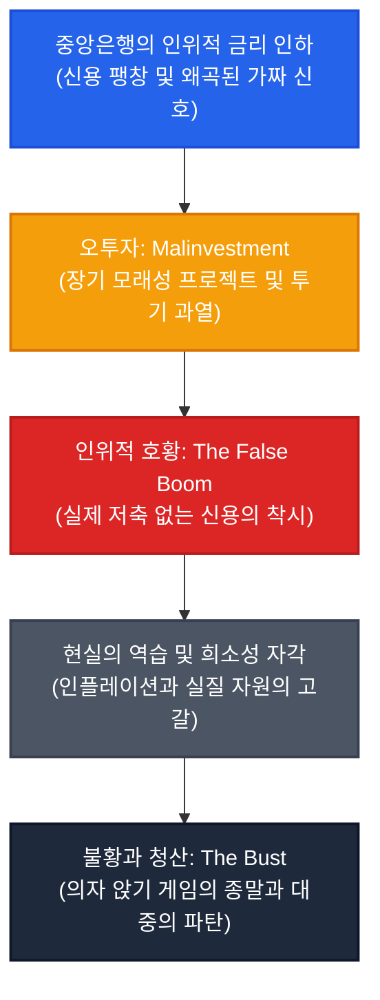

## 들어가며: 잘못 겨눠진 분노

주기적으로 찾아오는 자산 버블의 붕괴와 경기 침체 앞에서 서민들이 겪는 손실은 가혹하리만치 실재적이다. 집을 잃고, 평생을 일군 저축이 허공으로 증발하며, 일터에서 쫓겨난다. 

그리고 그 참담한 폐허 위에서 대중의 분노는 자연스레 불타오른다. 하지만 그 분노는 거의 언제나 **"탐욕스러운 자본주의"**라는 허수아비 아래 뭉뚱그려진다. 시장 자체가 본질적으로 착취적이라는 손쉬운 결론, 그리고 그 반사작용으로서 더 강력한 국가 개입과 더 중앙집권화된 통제를 요구하는 목소리가 시대의 상식이 된다.

이 글은 그 대중적 분노가 표적을 완전히 잘못 겨누고 있음을 논증하고자 한다. 우리가 겪는 고통의 태반은 자유롭게 작동하는 시장의 실패가 아니다. 그것은 오히려 **"경제를 하나의 거대한 기계처럼 중앙에서 공학적으로 통제할 수 있다"고 믿는 사고방식**, 그리고 그 사고방식을 자신의 자리·권위·이익의 원천으로 삼는 집단들이 만들어낸 구조적 필연에 가깝다. 

해법은 "자본주의냐 사회주의냐"라는 낡은 이념의 링 위에 있지 않다. 애초에 왜 우리가 수십 년째 정확히 같은 방식으로 수탈당하고 있는지를 냉정하게 직시하는 데서 시작해야 한다.

---

## 1. 두 개의 다른 자유주의: 관료의 자기보존 본능

"정부 개입 대 자유시장"이라는 대립 구도는 흔히 사소한 정책 선호의 차이로 오해된다. 그러나 오늘날 주류 정책을 장악한 케인스주의적 개입주의와, 국가 개입을 원칙적으로 최소화하려는 고전적 자유주의는 이름만 비슷할 뿐 출발점부터 근본적으로 다른 전제 위에 서 있다.

이 구분이 중요한 이유는 지극히 현실적이다. **개입은 통제자의 권한 확대를 의미하고, 최소 개입은 통제자의 권한 축소를 의미한다.** 

관료 조직이 스스로 자신의 존재 이유와 영향력을 축소하는 정책을 자발적으로 밀어붙일 이유는 구조적으로 희박하다. 이는 특정 관료가 사악해서가 아니다. 생명체가 그러하듯 모든 관료 조직 또한 자신의 생존과 확장을 도모하는 자기보존 본능을 갖기 때문이다.

그 결과 우리가 역사 속에서 목격한 것은 "고전적 자유주의가 실패했기에 개입주의가 구원투수로 등판했다"는 식의 승자 서사가 아니다. 19세기에도 자유주의적 정책이 부분적으로 시도되었으나, 20세기 들어 전쟁과 위기를 거치며 몸집을 불린 개입주의가 정책의 주류를 장악하면서, 고전적 자유주의는 온전히 시험받을 기회조차 얻지 못한 채 변방으로 밀려난 과정이었다.

---

## 2. 하이에크의 경고: 공학으로서의 경제와 복잡계의 한계

프리드리히 하이에크(Friedrich Hayek)는 『노예의 길』(1944)에서 하나의 필연적인 궤적을 경고했다. 경제를 하나의 거대한 기계처럼 설계하고 통제할 수 있다고 믿는 순간, 그 통제는 필요한 정보량의 폭발과 조정의 복잡성 때문에 점점 더 광범위하고 폭력적인 개입을 요구하게 된다는 사실이다.

소비에트 연방의 붕괴는 이 궤적이 도달할 수 있는 가장 극단적인 종착점을 역사적으로 증명한 비극이었다. 물론 이것이 "케인스주의가 곧 공산주의"라는 단순한 비약은 아니다. 개입의 수준과 방식은 전혀 다르다. 그러나 그 기저에 깔린 태도, 즉 **경제를 중앙에서 관측하고 미세 조정할 수 있는 공학적 제어 대상으로 바라보는 인식론적 전제**는 근본적으로 같은 뿌리를 공유한다.

이 태도가 치명적인 이유는 자명하다. 중앙의 어떤 천재적인 계획자나 지혜로운 위원회도 수백만 개인의 분산된 시간선호와 현장의 암묵지(tacit knowledge), 그리고 시시각각 변하는 주관적 가치를 온전히 파악할 수 없기 때문이다. 중앙은행이 금리를 "적정 수준"으로 설정하려는 시도 자체가 애초에 성립 불가능한 모순에 부딪힌다. 시장의 자유로운 가격 발견 기구를 거치지 않고서, 그 '적정 수준'이란 신(God)조차 알 수 없는 허상이기 때문이다.

---

## 3. 메커니즘: 인위적 신용 팽창에서 의자 앉기 게임까지

오스트리아 학파의 경기순환 이론(ABCT)은 이 지적 오만이 어떻게 실물 경제의 파국으로 치닫는지를 한 편의 냉혹한 서사로 풀어낸다.

1. **인위적 신용 팽창**: 중앙은행이 금리를 시장의 자연 수준보다 낮게 유지하면, 시장에는 실제 저축이 풍부하다는 치명적인 거짓 신호가 살포된다.
2. **오투자 (Malinvestment)**: 기업과 개인은 이 신호에 속아 춤을 춘다. 자연스러운 금리였다면 결코 성립하지 못했을 장기 대형 프로젝트와 한계기업, 그리고 투기적 자산에 눈먼 자본이 쏟아져 들어간다.
3. **인위적 호황**: 자산 가격이 폭등하고 일자리가 늘어나며 마치 지상낙원이 도래한 듯한 착시가 번진다. 그러나 이는 진짜 축적된 저축이 아니라 신용이라는 빚더미 위에 지어진 모래성이다.
4. **불황**: 언젠가 실물 자원의 희소성과 인플레이션이라는 물리적 벽에 부딪히며 냉혹한 현실이 폭로된다. 잘못 배분된 오투자는 피할 수 없는 청산의 단두대로 향한다.

이 국면에서 벌어지는 일은 본질적으로 잔혹한 **'의자 앉기 게임'**이다. 음악이 멈췄을 때 의자에 앉지 못하고 바닥으로 내동댕이쳐지는 쪽은 언제나 정보와 자본이 취약한 대중이다. 반면 구조를 미리 읽거나, 시스템 붕괴를 인질 삼아 위기 이후 구제금융을 낚아채는 쪽은 언제나 화폐의 진원지에 붙어 있던 자본가들이다.

이 메커니즘을 물리학 실험실처럼 실증적으로 완벽히 "입증"할 수 있느냐는 별개의 문제다. 인간 사회는 통제된 실험이 원천적으로 불가능한 복잡계이기 때문이다. 이 서사가 가치를 갖는 이유는 반증되지 않는 교조적 진리라서가 아니라, 뒤이어 살펴볼 제도적 인센티브 구조와 소름 끼칠 정도로 정확하게 맞아떨어지는 해석의 틀을 제공하기 때문이다.

---

## 4. 왜 이 구조는 반복되는가: 담합이 아닌 ‘인센티브의 정렬’

여기서 흔히 마주치는 반문이 있다. "그렇다면 이 모든 것이 소수 엘리트들이 밀실에서 꾸민 거대한 사기극이자 음모라는 말인가?"

답은 명백히 **"아니오"**다. 이것은 저열한 음모론이 아니다. 서로 다른 세 집단의 이기심이 **'중앙 통제의 확대'**라는 단 하나의 궤도 위에서 우연이자 필연으로 완벽하게 정렬(Incentive Alignment)된 결과다.

* **관료**:
  경제를 통제 대상으로 규정할수록 그들을 감시하고 규제할 기관과 인력, 그리고 배정받는 국가 예산은 비대해진다. 개입의 축소는 곧 자기 조직의 권한과 자리를 반납하라는 뜻이기에, 관료 기구는 본능적으로 위기 때마다 더 많은 개입을 정당화한다.
* **학계**:
  통제 지향적 이론이 주류를 차지할수록, 그 정교한 거시 모형을 다루는 경제학자에 대한 정부와 중앙은행의 수요가 폭발한다. 연구비와 자문료, 교수 문하의 제자들과 논문 실적이 꼬리를 물며 자기 증식적 생태계를 완성한다. 그리고 자신들의 모형이 현실의 위기를 전혀 맞히지 못할 때마다, "사회는 통제 변수가 무한한 복잡계"라는 방법론적 방패 뒤로 숨으며 이론의 수명을 연장한다. 이는 개별 학자의 양심과 무관하게 작동하는 차가운 선택 효과(selection effect)다.
* **자본가**:
  호황기에는 제로금리의 값싼 신용을 지렛대 삼아 이익을 극대화하고 자산을 쓸어 담는다. 그러다 불황의 파국이 닥치면 "우리가 쓰러지면 시스템 전체가 마비된다"는 대마불사의 공포를 무기 삼아 구제금융으로 손실을 납세자에게 전가한다.

이 세 집단은 서로 머리를 맞대고 모의할 필요조차 없다. 각자의 자리에서 가장 이기적이고 합리적으로 행동하는 것만으로도, **'더 많은 개입과 더 많은 신용 팽창'이라는 괴물**은 스스로 생명력을 얻고 폭주하게 된다.

---

## 5. 사적 이익, 공적 손실: 시스템의 추악한 도덕적 해이

이 구조가 붕괴의 순간에 찍어내는 최종 영수증은 참혹할 만큼 불공정하다.

| 호황의 파티를 즐긴 자들 (수혜자) | 불황의 숙취를 떠안는 자들 (희생자) |
| :--- | :--- |
| **값싼 신용으로 자산을 불린 금융기관** | 탐욕의 끝물에 막차를 탄 개인 투자자 |
| **차입 매수와 자사주 매입에 열 올린 대기업** | 치솟는 금리에 마진콜과 파산을 맞는 개인 차용자 |
| **통화 팽창 국면에서 자산 가치가 급등한 부유층** | 인플레이션의 화염 속에서 실질 구매력을 잃은 고정소득자 |
| **단기 호황 지표로 지지율을 챙긴 정치인** | 오투자가 청산되며 가장 먼저 길거리로 내몰린 노동자 |

불황이 닥치면 무모한 베팅을 일삼은 금융기관은 구조조정과 구제금융이라는 이름의 특혜를 누리고, 피땀 흘려 살아온 개인에게는 "투자의 자기책임을 지라"는 차가운 훈계만이 날아든다. 

성공의 과실은 철저히 사유화되고, 실패의 청구서는 고스란히 사회화되는 것. 이것이 바로 우리가 목도하는 시스템의 가장 뿌리 깊은 불공정이자 제도화된 **도덕적 해이(Moral Hazard)**의 실체다.

---

## 6. 그래서 무엇을 해야 하는가: 두 가지 함정 탈피와 준칙의 요구

우리는 여기서 두 가지 손쉬운 함정을 단호히 경계해야 한다.

첫째, **이 구조에 얽힌 행위자들을 단순히 '탐욕스러운 악당'으로 낙인찍는 감상적 도덕주의**다. 인간의 이기심은 상수다. 관료도, 학자도, 자본가도 대다수는 스스로 선의로 일하고 있다고 굳게 믿는다. 문제는 개인의 도덕성이 아니라, 그 이기심이 타인을 수탈하는 방향으로 치닫지 않도록 견제할 시스템의 부재다.

둘째, 그리고 훨씬 더 위험한 함정은, **이 구조에 대한 분노를 "자본주의 자체가 문제"라는 결론으로 비약시켜, 또 다른 형태의 중앙집권(사회주의, 더 강력한 국가 통제)을 대안으로 칭송하는 반사적 집단주의**다. 이것이야말로 2부에서 지적한 치명적인 인식론적 오만 — "우리가 중앙에서 경제를 설계하면 더 잘할 수 있다"는 환상 — 을 반복하는 것이며, 정확히 지금의 참사를 낳은 통제의 질병을 더 독한 농도로 되풀이하는 것에 불과하다.

진정으로 필요한 것은 대중이 이 거대한 인센티브의 톱니바퀴를 꿰뚫어 보는 일이다. 왜 호황은 인위적으로 직조되며, 왜 불황의 청구서는 언제나 가장 힘없는 자들의 문 앞에 배달되는지를 이해해야 한다. 

그 구조를 자각할 때 비로소 우리는 "국가가 더 개입해야 한다"는 감정적 외침과 "아무것도 하지 말라"는 무책임한 방임 사이의 거짓 이분법을 깨부술 수 있다. 그리고 통제자의 자의적 권한을 결박하고 이기심의 폭주를 견제할 수 있는 **냉혹하고 예측 가능한 준칙(Rule-based Framework)** — 조작할 수 없는 화폐, 구제금융의 원천 차단, 실패한 오투자에 대한 무자비한 시장 청산 — 을 당당히 요구할 수 있게 된다.

---

## 맺음말

이 글이 제시하는 설명이 경제학의 유일무이한 절대진리라고 강변하지는 않는다. 인간 사회는 통제된 실험이 불가능한 거대한 복잡계이며, 그 어떤 거시경제 서사도 물리학 법칙처럼 완벽하게 증명되거나 반증될 수 없다. 

그러나 적어도 단 하나는 명백하다. 호황의 과실이 누구의 주머니로 들어가고, 불황의 청구서가 누구의 목을 조르는지는 복잡한 수식과 이론을 걷어내도 너무나 선명히 목격되는 엄연한 역사적 사실이다. 

그 냉혹한 현실을 똑바로 응시하는 것에서부터, 우리는 잘못 겨눠진 허망한 분노를 거두고 시스템의 심장을 겨누는 정확한 질문을 던질 수 있다.
