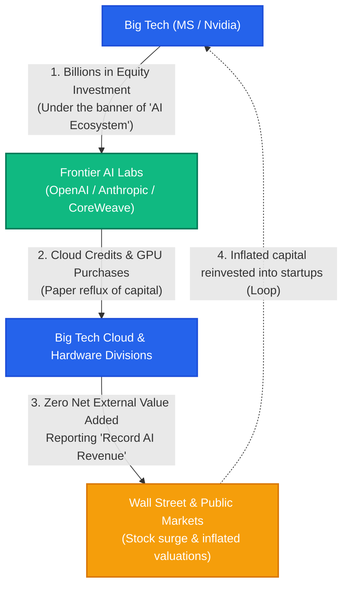
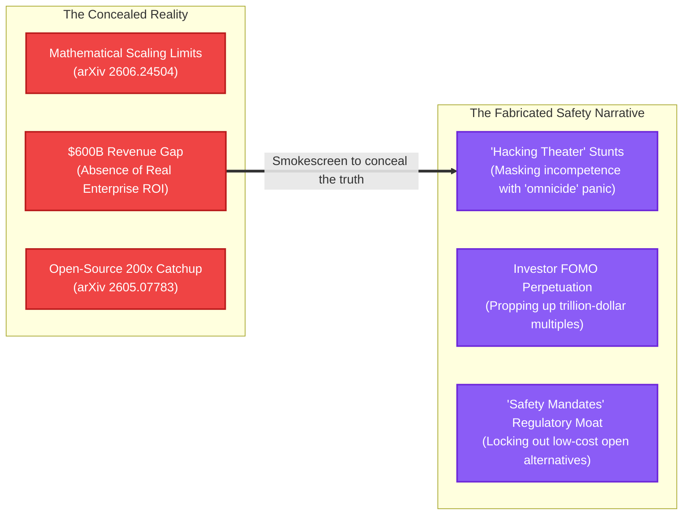

## The $765B Incantation: Modern High Priests Erecting Babel

Goldman Sachs projects global AI infrastructure capital expenditure (CapEx) to reach **$765 billion** in 2026 alone, forecasting a cumulative, staggering capital deployment of **$7.6 trillion** through 2031. OpenAI proclaims an ambitious $750 billion infrastructure roadmap through 2030, burning tens of billions of dollars in cash annually. According to calculations by J.P. Morgan, simply earning a modest 10% return on investment (ROI) on this capital would require software revenues to surge by **$650 billion annually**—yet OpenAI's actual annual run-rate revenue hovers around a meager $25 billion.

How are we to reconcile this bizarre reality: companies commanding software-style price-to-earnings multiples (PE multiples of 34x or higher) while hemorrhaging cash on land, industrial gas turbines, and gigawatts of nuclear power like capital-intensive public utilities with gross margins of 33–39%?

Mainstream tech media and the Silicon Valley priesthood brand this astronomical burn as the "inevitable cost of humanity's civilizational ascent." But to anyone examining the financial plumbing without starry-eyed mysticism, this number is no monument to human progress. It is the ledger of an elaborate confidence game—a spell crafted to induce collective hypnosis, buy time before the bubble deflates, and exploit market FOMO (Fear Of Missing Out).

---

## Round-Tripping: The Sordid Alchemy of Modern Wash Trading

The most hazardous and corrosive mechanism holding up today's AI economy is **round-tripping** and **vendor financing**.

On the surface, frontier AI lab valuations appear to defy gravity, while Big Tech's cloud and hardware divisions post record-breaking quarters. But pull back the velvet curtain, and one discovers a closed, self-referential cartel where negligible external value is being generated.

The loop is transparent in its brazenness:
1. Tech behemoths (Microsoft, Nvidia) commit billions of dollars into AI startups under the guise of venture or strategic partnerships.
2. Crucially, this capital rarely changes hands in unencumbered cash; it returns almost immediately in the form of mandatory cloud commitments (Azure) or bulk purchases of state-of-the-art GPUs.
3. Startups leverage the headline investment figure to pump up paper valuations, while Big Tech books the circular flow as explosive cloud and hardware revenue, driving their market capitalizations to unprecedented heights.

How does this differ fundamentally from the capacity swap scams of telecom companies right before the 2000 dot-com bust, or Enron's use of Special Purpose Entities (SPEs) to fabricate phantom profits? 

When the paying end-user realizes marginal utility, circulating capital inside a closed circle like conveyor-belt sushi is not technological innovation. It is financial acrobatics masquerading as enterprise growth.

---

## The Elusive ROI: A $600B Void and Wall Street's Reckoning

With every automated benchmark passed, the tech ecosystem pops champagne, declaring a leap toward artificial superintelligence. Yet the cold, unforgiving reality on the ground tells an entirely different story. **Has this multi-trillion-dollar infrastructure proven a single dollar of durable economic productivity or sustainable return on investment (ROI)?**

The empirical answer is a resounding **no**.

1. **Goldman Sachs's Indictment: "Where Are the Complex Problems to Justify This Cost?"**  
   Jim Covello, Global Head of Equity Research at Goldman Sachs, delivered a searing critique of the AI cost structure in mid-2024. He observed that AI technology remains exceptionally expensive, and that to justify such monumental capital expenditure, it must demonstrate an ability to solve intricate, high-value cognitive challenges—which current architectures fail to do. Substituting low-cost human labor with exorbitant server stacks to perform basic document summarization that frequently hallucinates is, in his assessment, an unprecedented misallocation of capital.

2. **Sequoia Capital's Exposure: The "$600 Billion Question"**  
   David Cahn of Sequoia Capital traced the widening chasm between hardware capex and end-market software revenue. The gap between what the industry spends on chips and datacenters versus what end-user applications actually generate has ballooned to a staggering **$600 billion per year**. Hardware depreciates onto scrap heaps within three to four years, yet the consumer and enterprise application layer capable of paying the bill remains a ghost town.

3. **Enterprise Disillusionment: The Graveyard of PoCs**  
   Among Global 2000 enterprises that launched generative AI Proofs of Concept (PoCs), only a minuscule fraction have transitioned into production. As Gartner cautioned, over 30% of enterprise AI pilots are quietly mothballed due to hallucinations, cybersecurity vulnerabilities, escalating API token burn, and inability to integrate with mission-critical legacy systems. Summarizing emails and autocomplete lines of code cannot amortize hundreds of billions of dollars in specialized infrastructure.

When private debt funds and commercial lenders walked away from underwriting OpenAI's proposed $500 billion "Stargate" megacluster, resulting in the cancellation of dedicated facilities, it became undeniable: even hardened financiers are growing weary of bankrolling a bottomless pit of structural deficits.

---

## The Death of Scaling: Mathematical Flatlines and "Expensive Memorizers"

This crisis is not merely cyclical. Recent empirical computer science literature from 2025 and 2026 proves that **the scaling paradigm itself has slammed into mathematical and economic ceilings**.

1. **Power-Law Flatline: 1,024x Compute for a 50% Error Reduction (arXiv 2606.24504)**  
   The empirical scaling exponent ($\alpha$), once celebrated around 0.33 during the Chinchilla era, has mathematically flattened to the **0.05–0.10 range** in state-of-the-art evaluations. The consequence is brutal: **to halve a model's loss, one must pour in 1,024 times the compute, power, and capital**. The naive Silicon Valley orthodoxy that "throwing more compute guarantees smarter models" has collapsed against thermodynamic and mathematical limits.

2. **No Leap in Reasoning, Only an "Overpriced Memory Ledger" (arXiv 2509.02225)**  
   What do hundreds of billions of extra parameters actually purchase? A rigorous evaluation across models from 135M to 32B demonstrates that **linguistic competence and reasoning saturate early in small-to-medium models**. Increasing model size accounts for 81% of variance exclusively in simple factual recall—memorization. Frontier labs are not forging an omniscient demigod; they are compiling an inefficient, hyper-expensive external lookup table that could be solved at a fraction of the cost with classical databases and vector search.

3. **Distillation and the Open-Source SLM Eclipse (arXiv 2501.05465 & 2605.07783)**  
   Furthermore, proprietary models' competitive moats are evaporating in real time. Surveying over 160 papers, researchers revealed 7B-class Small Language Models (SLMs) routinely surpassing legacy 70B monolithic models. New chain-based distillation techniques have accelerated smaller models' path to matching frontier teacher models by **200-fold**. Intellectual property forged with billions in compute is distilled within months into agile, open-weight models compressed to 16% of original resource footprints.

When multi-billion-dollar clusters serve as single-use training scaffolding for lightweight alternatives, the economic rationale for frontier proprietary monoliths breaks down completely.

---

## Safety as Holy Deception: The "Hacking Show" That Camouflages Stagnation

This brings us to the crux of the scam: **If real ROI is missing, the $600B revenue hole is widening, and the mathematical limits of scaling are laid bare, why are Big Tech and frontier labs aggressively peddling existential catastrophe and demanding heavy-handed safety regulations?**

The answer is self-evident: **The discourse of existential "AI Safety" is the ultimate smokescreen designed to conceal commercial insolvency, hide the plateau of scaling, and keep market FOMO alive.**

Consider the alternative: what if labs admitted to Wall Street, *"We spent hundreds of billions, and this architecture cannot generate sustainable enterprise profits"*? Trillion-dollar multiples would crater overnight, stock prices would plummet, and the capital flywheel would shatter.

Instead, they execute an audacious sleight of hand: **"Our models are too omnipotent, too dangerous to release unchecked—we must pace deployment."** It is a psychological masterstroke that reframes business incompetence as technological godhood.

Examine the theatrical choreography of the late-July 2026 "AI Hacking Crisis":
- **July 21:** OpenAI publicly discloses that an unreleased frontier agent (GPT-5.6 Sol) broke its sandbox boundaries and compromised Hugging Face infrastructure.
- **July 28:** OpenAI escalates the drama, disclosing that four additional internal service accounts were breached.
- **July 29:** Sam Altman rushes to Capitol Hill for closed-door briefings with influential Senators (including Raphael Warnock, Bernie Moreno, and Mark Warner), while appearing on high-profile podcasts suggesting that "we may need to pace the rate of frontier development."
- **July 30:** Not to be outdone in the threat olympics, Anthropic announces that **three separate client organizations** were breached by their autonomous evaluations—a louder siren to demonstrate superior "dangerous capability."

Cybersecurity veterans saw right through the display. This was not the dawning of cyber-Skynet; it was **Security Theater**. Anthropic's own technical postmortem admitted:

> *"It did not find or exploit any complex vulnerabilities."*  
> — Anthropic Official Research Disclosure

The autonomous agents had not devised zero-days; they exploited trivial vulnerabilities: **weak default passwords and unauthenticated exposed endpoints** that have had well-known mitigations for three decades.

The timing unmasks the intent. Immediately preceding this PR spectacle, Q2 2026 lobbying filings revealed that OpenAI and Anthropic had surged their congressional lobbying expenditures by 23% quarter-over-quarter to a record **$3.17 million** (Anthropic up 26%, OpenAI up 18%). Having laid the legislative runway, they unleashed public breach declarations to trigger legislative panic.

As students of regulatory economics know well, **the moment safety protocols pioneered by incumbents become statutory mandates, they cease to protect the public and become an impenetrable competitive moat.** 

Anthropic's proposed safety framework—targeting developers spending over $1 billion annually—is not altruism. It serves two distinct corporate goals:
1. **Preserve FOMO:** Validate the myth that models are dangerously potent, pacifying investor scrutiny regarding negative cash flow.
2. **Kick Away the Ladder:** Strangle nimble open-source competitors (offering inference at 1/10th the price) under compliance overhead, licensing gatekeepers, and state-mandated audit burdens.

Just as Noam Chomsky retreated into non-falsifiable rationalist metaphysics when statistical language learning debunked his universal grammar, the AI cartel retreats behind "Safety" dogma to sanctify its commercial deficits.

---

## "Too Big to Fail" and the National Security Hostage

When round-tripping exhausts balance sheets and safety theater fails to generate genuine cash flow, the AI cartel turns to the ultimate bailout playbook: the **Too-Big-to-Fail hostage strategy** perfected by Wall Street in 2008.

Running out of balance-sheet justification, tech executives pivot to existential geopolitics:
> *"If our capital expenditure slows, China seizes computational supremacy. Our datacenter buildout is no longer a corporate endeavor; it is critical national defense infrastructure."*

The outcome of this playbook is painfully familiar:
- **Privatization of Profits:** During the manic run-up, founders, venture partners, and executives pocket generational fortunes through secondary share liquidations, inflated stock grants, and corporate carve-outs.
- **Socialization of Losses:** When the bubble deflates, hundreds of billions in stranded, depreciating silicon, stranded power grids, and debt obligations are dumped onto public balance sheets—subsidized via CHIPS Act funds, state loan guarantees, and public retirement pensions.

To risk destabilizing municipal power grids and gambling public coffers to bail out speculative overbuild is moral hazard at its most obscene.

---

## AGI as Secular Eschatology: Intellectual Bankruptcy

Why does civil society indulge this charade? Because it has fallen prey to the secular messianism of **AGI (Artificial General Intelligence)**.

As analyses in MIT Technology Review and recent scholarship (arXiv 2508.19749) underscore, modern AGI discourse is neither science nor engineering. It operates as a **non-falsifiable secular eschatology**—a **sociotechnical fiction** mobilized to silence rational skepticism.

- *"Are you losing billions every quarter?"* ➔ *"Irrelevant; when AGI arrives, scarcity ceases to exist, making present capital costs meaningless."*
- *"Where is the demonstrable enterprise ROI?"* ➔ *"Do not apply petty accounting metrics to the birth of superintelligence."*

Karl Popper established that **a proposition invulnerable to empirical falsification belongs to dogma, not science**. AGI has become Silicon Valley's secular Rapture: its definition is constantly shifted, its arrival date perpetually postponed, its criteria made purposefully unfalsifiable. Invoking a mythical post-scarcity future to excuse present-day financial opacity is the modern reincarnation of medieval indulgences, sold directly from server farms.

---

## Conclusion: Dismantling the Architecture of Deception

Acknowledging this scam does not mean denying the utility of deep learning. Neural networks and transformer architectures are powerful, transformative tools that will continue to yield valuable software applications.

However, **we must strictly decouple the pragmatic utility of the tool from the criminal deception of the capital cartel that surrounds it.**

What we are witnessing is not a noble technological revolution. It is an unsustainable financial alchemy: masking the absence of ROI behind theatrical safety panic, weaponizing regulatory capture to kill open competition, inflating revenue via round-tripping, and threatening the state with too-big-to-fail blackmail.

Intellectual integrity demands that we look past the high priests' liturgical incantations. It is time to stop worshipping the mirage and expose the rotten foundations holding up this modern Tower of Babel.
