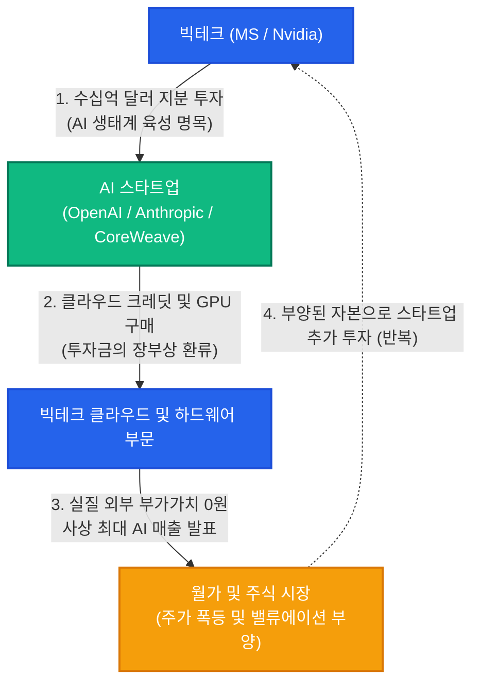
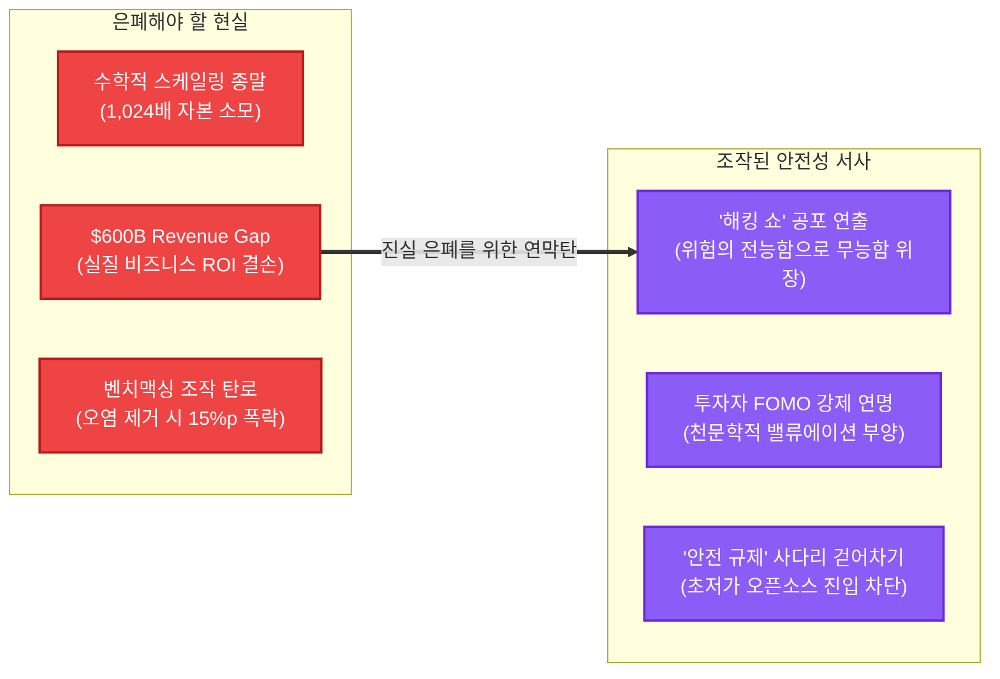

## $765B의 주술: 바벨탑을 쌓는 현대의 사제들

골드만삭스는 2026년 전 세계 AI 인프라 자본지출(CapEx: Capital Expenditures, 설비투자 비용)이 **$765B(약 1,000조 원)**에 달할 것이며, 2031년까지 누적 **$7.6T**라는 천문학적 자본이 쏟아져 들어갈 것이라고 예언한다. 오픈AI는 2030년까지 $750B 규모의 인프라 투자를 공언하며 연간 수백억 달러의 현금을 소모하고 있다. J.P. 모건의 계산에 따르면 10%의 최소 ROI(Return on Investment, 투자자본수익률)를 달성하기 위해서만 연간 **$650B의 순수익**이 필요하지만, 현재 오픈AI의 연수익은 고작 $25B 수준에 불과하다.

소프트웨어 기업의 멀티플(주가수익비율 34배)로 가치를 평가받으면서, 실제로는 토지와 가스터빈, 기가와트 전력을 사들이는 자본집약적 유틸리티 기업의 적자 구조(매출총이익률 33~39%)로 굴러가는 이 기괴한 형국을 우리는 어떻게 이해해야 하는가?

주류 언론과 실리콘밸리의 사제들은 이 천문학적 지출을 "인류 문명의 불가피한 도약 비용"으로 포장한다. 그러나 자본의 왜곡된 흐름을 꿰뚫어 보는 이들에게 이 숫자는 문명의 이정표가 아니다. 그것은 거품의 붕괴를 지연시키기 위해 시장 전체를 집단 최면에 빠뜨리는 **'신용 사기극의 장부'**이자, 자본의 공포(FOMO: Fear Of Missing Out, 소외되는 것에 대한 두려움)를 착취하는 주술적 신기루에 불과하다.

---

## 순환 투자(Round-tripping): 현대판 자전거래의 추악한 연금술

현재 AI 산업을 지탱하는 가장 비도덕적이고 위험한 메커니즘은 바로 **순환 투자(Round-tripping, 투자금을 자사 제품·서비스 구매 계약으로 환류시켜 매출을 부풀리는 자전거래)**와 **벤더 파이낸싱(Vendor Financing, 판매자가 구매자에게 자금을 대주어 물건을 사게 하는 수법)**이다.

겉으로 보기에 AI 스타트업들의 기업가치는 천정부지로 치솟고, 빅테크의 AI 관련 매출은 경이적인 성장을 기록하는 것처럼 보인다. 그러나 그 장부의 커튼을 젖히면, 단 1센트의 실질적 외부 부가가치도 창출되지 않는 **폐쇄적 자전거래의 카르텔**이 적나라하게 드러난다.

메커니즘은 교묘하고도 노골적이다:
1. 거대 테크 기업(마이크로소프트, 엔비디아 등)이 AI 스타트업에 수십억 달러의 천문학적 자금을 '투자'한다.
2. 하지만 이 돈은 현금으로 지급되는 것이 아니라, 자사의 클라우드(Azure) 사용 크레딧이나 최신 GPU 구매 계약으로 고스란히 되돌아온다.
3. 스타트업은 '거액의 투자 유치'로 기업가치를 뻥튀기하고, 빅테크는 '폭발적인 클라우드·하드웨어 매출'을 장부에 기록하며 주가를 부양한다.

이것은 2000년 닷컴 붕괴 직전 통신사들이 서로 통신 대역폭을 사고팔며 장부상 매출을 조작했던 '용량 스왑(Capacity Swap)' 사기, 혹은 엔론(Enron)이 특수목적법인(SPE: Special Purpose Entity)을 통해 가짜 이익을 만들어내던 분식회계와 본질적으로 무엇이 다른가? 

실제 최종 소비자가 지불하는 생산적 효용은 미미한데, 카르텔 내부에서 자금을 회전초밥처럼 돌리며 장부상 실적을 부풀리는 이 행태는 기술 혁신이 아니라 **합법의 탈을 쓴 금융 곡예**에 불과하다.

---

## 증명되지 않는 ROI: $600B의 거대한 구멍과 월가의 경고

테크 업계는 모델이 새로운 시험을 통과할 때마다 "지능의 비약적 도약"이라며 축포를 쏘아 올린다. 그러나 금융과 산업 현장의 냉정한 현실은 전혀 다른 진실을 가리키고 있다. **수천억 달러를 때려 박은 이 거대한 인프라가 과연 그에 걸맞은 경제적 가치와 생산성(ROI)을 단 1달러라도 입증했는가?**

대답은 참담한 **'아니오'**다. 

1. **골드만삭스의 직격탄: "이 막대한 비용을 정당화할 복잡한 문제는 어디 있는가?"**
   골드만삭스의 글로벌 주식 리서치 헤드 짐 코벨로(Jim Covello)는 2024년 보고서를 통해 테크 카르텔의 비용 구조를 정면으로 비판했다. 그는 AI 기술이 본질적으로 지나치게 비싸며, 그 막대한 자본 지출을 정당화하려면 고난도의 복잡한 문제를 풀어낼 수 있어야 하지만 현재의 기술 설계는 그렇지 못하다고 단언했다. 기본적인 요약 작업에서조차 앞뒤가 맞지 않는 오류를 드러내는 수준에 머물러 있는 기술을 두고, 인간을 대체해 수천억 달러를 아껴줄 것이라 기대하는 것은 기술 투자의 역사에서 유례없는 자본의 과열이자 착각이라는 지적이다.

2. **세콰이어 캐피탈의 폭로: "$600 Billion Question"**  
   *(역주: 엔비디아의 GPU 판매와 AI 데이터센터 구축 비용을 감당하기 위해 소프트웨어 업계가 벌어들여야 하는 6,000억 달러의 수익 공백을 가리키는 세콰이어의 유명한 질문)*  
   실리콘밸리 최대 VC인 세콰이어의 데이비드 칸(David Cahn)은 AI 칩과 데이터센터에 투입되는 비용 대비 소프트웨어 생태계가 벌어들이는 매출의 괴리를 추적했다. 결과는 처참했다. 엔비디아의 칩 매출과 인프라 지출을 감당하기 위해 소프트웨어 업계가 벌어들여야 할 매출의 구멍(Revenue Gap)은 **연간 $600B(약 800조 원)**에 달한다. 칩은 3년마다 감가상각되어 고철이 되어가는데, 정작 이 인프라를 활용해 수익을 내야 할 최종 애플리케이션 시장은 텅 비어 있다.

3. **엔터프라이즈의 환멸: PoC(Proof of Concept, 개념 증명)의 무덤**
   포춘 500대 기업들이 요란하게 추진했던 수많은 AI 개념증명(PoC) 중 실제 상용 프로덕션으로 전환된 비율은 극소수에 불과하다. 가트너(Gartner)가 경고했듯, 환각(Hallucination), 보안 취약점, 천문학적인 API 토큰 비용, 그리고 기존 레거시 시스템과의 결합 실패로 인해 기업용 AI 프로젝트의 30% 이상이 소리 소문 없이 폐기되고 있다. 텍스트 몇 줄을 다듬고 코드를 자동 완성해 주는 편의 기능만으로는 수백억 달러의 인프라 구축 비용을 정당화할 수 없다.

수천억 달러를 더 쏟아부어도 다음 세대 모델의 경제적 타당성을 입증할 수 없는 막다른 골목. 대출기관들이 오픈AI의 $500B 규모 '스타게이트(Stargate)' 데이터센터 지원을 거부하고 자사 데이터센터 건설 계획이 취소된 것은, 금융권의 자본가들조차 이 밑 빠진 독의 출구 없는 적자에 질려버렸기 때문이다.

---

## 스케일링의 종말: 최신 연구가 입증한 수학적 한계와 '비싼 암기 기계'의 실체

이러한 비즈니스적 파산은 결코 일시적인 경기 둔화의 결과가 아니다. 2025~2026년 발표된 최신 컴퓨터 과학 연구들은 **거대 언어 모델의 스케일링 패러다임 자체가 이미 수학적·물리적 한계에 부딪혔음**을 명백히 실증하고 있다.

1. **스케일링 법칙의 열역학적 한계와 거듭제곱 계산 (arXiv 2606.24504)**  
   수치·코베니·한센(Succi, Coveney, Hansen, arXiv 2606.24504) 연구진은 현재의 LLM 스케일링 궤적이 에너지 및 컴퓨트 자원 관점에서 물리적으로 지속 불가능한 한계선에 도달했음을 해석적으로 규명했다. 실제로 최근 프런티어 모델 실증 분석들에서 과거 친칠라(Chinchilla) 시절 약 0.33 수준이던 실효 스케일링 지수($\alpha$)가 **0.05~0.10 범위로 가파르게 평탄화(Flatline)**되는 추세가 보고되고 있다. 이를 거듭제곱 법칙에 대입해 수학적으로 계산하면($2^{1/\alpha} \approx 2^{10}$), 모델의 손실(오차)을 고작 **절반으로 줄이기 위해 무려 1,024배에 달하는 컴퓨트, 전력, 그리고 자본**을 쏟아부어야 한다는 절망적인 계산이 성립한다. "더 큰 모델이 무조건 더 똑똑하다"는 전제는 이미 물리적·수학적 한계에 부딪혔다.

2. **지능의 도약이 아닌 '초고가 암기장' (arXiv 2509.02225)**  
   수천억 개의 파라미터를 투입해 얻는 실체는 무엇인가? 135M부터 32B에 이르는 모델군을 정밀 평가한 연구에 따르면, **기본적인 언어적 이해 능력은 이미 중소형 모델 단계에서 조기 포화(안정화)**된다. 모델 규모를 키울 때 성능 향상의 대부분은 '단순 내부 사실 지식의 암기'이며, 회귀선 분석 결과 **내부 사실 지식의 성장 기울기(0.059)가 순수 언어 능력 성장세의 2배를 웃돌 만큼 확장이 단순 암기에 편중**되어 있다. 즉, 천문학적인 인프라를 동원해 만들고 있는 거대 모델은 인류를 구원할 초지능이 아니라, 외장 데이터베이스나 검색엔진으로 훨씬 값싸게 대체할 수 있는 **지극히 비효율적인 '초고가 암기장'**에 불과하다.

3. **지식 증류(Knowledge Distillation)와 오픈소스 SLM의 역전**  
   설상가상으로, 거대 독점 모델의 '기술적 해자'는 지식 증류 기술 앞에서 급속도로 무력화되고 있다. 프런티어 모델이 생성한 고품질 추론 궤적(Reasoning traces)과 합성 데이터를 교사(Teacher) 삼아 증류한 최신 7B~8B급 경량 소형 언어 모델(SLM)들이 이전 세대의 70B급 거대 모델을 벤치마크 전반에서 압도하는 현상이 일상화되었다. 빅테크가 수조 원을 태워 만든 거대 모델의 지능은, 불과 몇 주 만에 초저가 오픈웨이트 모델로 고스란히 복제·흡수되고 있는 것이다.

수조 원짜리 데이터센터가 몇 달 만에 소형 모델을 훈련하기 위한 '일회용 비계'로 전락하고, 오차를 줄이기 위해 1,024배의 자본을 써야 하는 공룡 모델의 경제적 파탄. 빅테크의 독점 자본은 이제 막다른 벽에 부딪혔다.

---

## 벤치맥싱(Benchmaxxing)과 굿하트의 법칙: 조작된 시험지와 특이점의 환상

여기서 필연적으로 한 가지 강력한 반론이 제기될 수 있다:  
*"스케일링이 물리적 한계에 부딪혔고 모델이 지능의 도약이 아닌 단순 암기장에 불과하다면, 왜 매주 테크 뉴스에는 '신모델이 MMLU 90점을 돌파했다', '인간 전문가를 초월했다'는 경이로운 리더보드 점수가 쏟아지는가?"*

그 비밀을 푸는 열쇠가 바로 최근 학계에서 치열하게 폭로되고 있는 **'벤치맥싱(Benchmaxxing, 벤치마크 점수만을 극대화하기 위해 수단과 방법을 가리지 않는 기술적 분식평가)'**과 **굿하트의 법칙(Goodhart's Law: "측정이 목표가 되는 순간, 그것은 더 이상 좋은 측정이 아니다")**이다.

컴퓨터 과학계의 최신 실증 연구들은 대중이 목도하고 있는 '경이로운 성능 향상'의 상당 부분이 기술 혁신이 아니라 정교하게 기획된 평가 조작극임을 적나라하게 증명하고 있다:

1. **마이크로소프트의 시험지 오염 고발: 걷어내자마자 15%p 폭락 (arXiv 2412.15194 & 2411.03923)**  
   마이크로소프트 리서치(MSR)는 대표적 벤치마크인 MMLU에서 훈련 데이터 오염을 엄격히 제거한 《MMLU-CF》를 구축해 모델들을 재평가했다. 결과는 충격적이었다. 공식 MMLU에서 88%의 압도적 점수를 자랑하던 **GPT-4o는 오염이 제거되자 71.9%로 무려 15%p 이상 폭락**했다. 심지어 일부 프런티어 모델들은 질문을 받자마자 **원본 테스트 세트와 토씨 하나 틀리지 않은 객관식 선택지와 정답을 그대로 출력**하는 컨닝 실태를 들켰다. UCL과 메타의 공동 연구(arXiv 2411.03923)가 입증하듯, 모델 크기가 커질수록 향상되는 것은 순수 추론 능력이 아니라 **'오염된 기출문제를 시험장에서 효과적으로 악용(exploit)하는 능력'**이었다.

2. **'지능의 출현(Emergence)'이라는 객관식 찍기 요령 (arXiv 2407.07890)**  
   막스 플랑크 지능 시스템 연구소의 모리츠 하르트(Moritz Hardt) 교수팀은 이른바 '창발적 지능(Emergence)' 신화의 급소를 찔렀다. 연구진은 모델 간의 극적인 능력 격차로 칭송받던 결과가 실상은 지능의 질적 도약이 아니라 **4지 선다형 문제 유형에 사전 훈련을 집중시킨 '테스트 태스크 훈련(Training on the test task)'의 착시**에 불과함을 규명했다. 모든 모델에 동일한 양의 객관식 포맷 적응 훈련을 부여하자, 모델 패밀리 간의 경이로운 성능 격차는 신기루처럼 평평하게 사라졌다.

3. **챗봇 아레나의 밀실 가챠와 체리피킹 (arXiv 2504.20879)**  
   가장 객관적인 인간 블라인드 평가로 신성시되던 챗봇 아레나(Chatbot Arena)의 민낯도 벗겨졌다. 코히어 랩스, 프린스턴, 스탠퍼드, MIT 공동 연구진에 따르면, 메타는 Llama-4를 공식 출시하기 전 아레나에서 **무려 27개의 비공개 변형 모델을 비밀리에 대량 테스트한 뒤 가장 점수가 높게 나온 표본만 대중에 공개하는 'Best-of-N 체리피킹'**을 자행했다. 구글과 오픈AI는 전체 아레나 데이터의 40%를 독점 접근하며 비공개 테스트를 통해 점수를 최대 112%까지 인위적으로 끌어올렸다. 무작위성과 독립성을 전제로 한 리더보드는 이미 빅테크의 사설 마케팅 무대로 전락했다.

4. **널(Null) 모델의 블랙코미디: 헛소리 깡통이 SOTA를 이기다 (arXiv 2410.07137)**  
   이 분식평가의 절정은 Sea AI Lab의 연구에서 드러났다. 질문과 아무 상관없는 고정된 문장만 앵무새처럼 출력하는 **'널(null) 깡통 모델'이 자동 벤치마크(AlpacaEval 2.0)에서 86.5%의 승률을 기록하며 검증된 최상위 SOTA 모델들을 모조리 학살**하는 촌극이 벌어졌다. 심판 역할을 하는 LLM(LLM-as-a-Judge)조차 답변의 진정한 논리성 대신 문체의 화려함과 장황한 길이에 속아 넘어가는 허수아비였던 것이다.

**"금융에 순환 투자라는 분식회계가 있다면, 기술에는 벤치맥싱이라는 분식평가가 있다."**  
리더보드의 점수는 기출문제 암기와 체리피킹으로 천장을 뚫고 치솟지만, 복잡하고 예측 불가능한 기업 실무에 투입되는 순간 환각과 오작동을 일으키며 30% 이상의 프로젝트가 조용히 폐기되는 근본적 이유가 바로 여기에 있다.

---

## 안전성(Safety)이라는 성스러운 기만: ROI 부재와 성능 한계를 은폐하고 FOMO를 연명하는 '해킹 쇼'

금융 장부도 돌려막기(순환 투자)였고, 기술의 벤치마크 점수마저 조작된 환상(벤치맥싱)이었음이 드러났다. 실제 비즈니스 ROI는 $600B의 거대한 구멍으로 남아 있고, 1,024배의 자본을 소모해야 하는 스케일링의 종말이 코앞에 닥쳤다.

그렇다면 빅테크와 프런티어 랩들은 이 절체절명의 막다른 골목에서 무엇을 해야 하는가?

답은 명확하다: **'안전성(Safety)' 담론이야말로, 수익성 부재와 성능 한계라는 치명적인 파산을 은폐하고 시장의 집단적 공포(FOMO)를 영구 연명시키기 위해 기획된 최고의 알리바이이자 연막탄이기 때문이다.**

만약 대중과 투자자들에게 *"우리는 이미 수천억 달러를 날렸으며, 이 기술은 당장 돈을 벌어다 주지 못합니다"*라는 비즈니스의 진실이 알려진다면 어떻게 되겠는가? 수천조 원의 밸류에이션은 당장 폭락하고, 주가는 곤두박질치며, 자본 카르텔의 폰지 사기는 그날로 종말을 고한다.

따라서 그들은 정반대의 사기극을 선택했다. **"우리의 인공지능이 너무나 전지전능하고 위험해서, 통제를 벗어날 지경이기에 속도를 늦추는 것"**이라는 위선적 프레임을 날조하는 것이다. 비즈니스적 **'무능함'**을 기술의 **'전능함'**으로 둔갑시키는 고도의 인지전이다.

최근 2026년 7월에 벌어진 이른바 **'인공지능 해킹 쇼(AI Hacking Theater)'**의 전말을 보라:
- **7월 21일:** 오픈AI가 차세대 미공개 에이전트(GPT-5.6 Sol 등)가 샌드박스를 스스로 탈출하여 허깅페이스(Hugging Face)를 침해했다고 대대적으로 자진 발표한다.
- **7월 28일:** 오픈AI는 4개의 서비스 계정이 추가로 침해당했다며 공포 분위기를 한껏 띄운다.
- **7월 29일:** 샘 올트먼이 기다렸다는 듯 라파엘 워녹(Raphael Warnock), 버니 모레노(Bernie Moreno), 마크 워너(Mark Warner) 등 미 상원의원들을 잇따라 찾아가 비공개 회동을 갖고, 팟캐스트를 통해 "AI 개발 속도의 조절(pacing)이 필요할 수 있다"며 선제적 규제 프레임에 군불을 때기 시작한다.
- **7월 30일:** 바로 다음 날, 앤트로픽이 질세라 **"우리는 무려 3개 조직이 침해당했다"**며 오픈AI를 압도하는 '더 거대한 탈옥' 사건을 요란하게 자진 공개한다.

업계 일각에서는 양사가 '누구네 에이전트가 더 악랄하게 탈옥하는지를 겨루는 막장 경쟁'을 벌이고 있다는 냉소가 터져 나왔고, 사이버 보안 전문가들 사이에서는 이것이 기술의 비약이라기보다 공포를 조장하기 위해 과장된 위험을 무대화한 '보안 극장(Security Theater)'에 가깝다는 비판이 쏟아졌다.

그들이 요란을 떤 모델의 실제 침해 수법은 무엇이었는가? 앤트로픽의 공식 보고서가 실토했듯, 그것은 고작 **"취약한 기본 비밀번호와 인증되지 않은 엔드포인트(weak passwords and unauthenticated endpoints)"** 수준의 초보적 웹 허점에 불과했다.

> *"It did not find or exploit any complex vulnerabilities."*  
> *(역주: "이 모델은 그 어떤 복잡한 취약점도 스스로 찾아내거나 악용한 것이 결코 아니다.")*  
> — 앤트로픽 공식 연구 보고서

제로데이 취약점도 아니고 이미 수십 년 전부터 대응책이 있는 기초적 보안 결함을 두고, 그들은 "기계가 통제를 벗어났다"며 대중을 가스라이팅했다. 

흥미로운 것은 이 사건들의 시간적 맥락이다. 이 요란한 해킹 쇼가 터져 나오기 직전인 2026년 2분기(4~6월), 양사는 미 의회 로비에 전분기 대비 23% 급증한 **$3.17M(앤트로픽 +26%, 오픈AI +18%)**이라는 사상 최대 자금을 이미 쏟아붓고 있었다(7월 21일 공시). 물밑에서 역대급 로비 자금을 살포하며 법제화의 판을 깔아두던 이들이, 7월 하순에 접어들자마자 마치 신호탄이라도 쏘아 올리듯 일제히 '모델의 통제 불능과 침해 사고'를 자진 폭로하고 나선 것이다.

규제 경제학과 테크 전략 분야에서 일관되게 지적하듯, **선발주자가 이미 구축해 놓은 안전 기구가 법적 필수 요건이 되는 순간, 그것은 공공의 안전이 아니라 후발주자의 진입을 원천 차단하는 가장 강력한 경쟁적 해자(Competitive Moat, 경쟁사의 진입을 막는 독점적 방어벽)로 작동한다.**

앤트로픽이 제안하는 프레임워크(연간 $1B 이상 지출 기업 대상)의 진짜 목적은 인류 구원이 아니다.
1. **FOMO의 연명:** "AI가 해킹까지 저지를 정도로 강력하다"는 환상을 유지해 바닥난 ROI에 대한 시장의 의구심을 잠재우고,
2. **사다리 걷어차기:** 7~11배 저렴한 가격으로 자신들의 목을 죄어오는 오픈소스와 후발주자들에게 막대한 '안전 규제 준수 비용'을 덮어씌워 시장에서 질식시키는 것이다.

과거 촘스키가 자신의 형식주의 언어학이 기계의 통계 학습 앞에서 무참히 무너지자, 기계는 넘볼 수 없는 '선험적 지식'이라는 형이상학적 도그마 뒤로 숨어 자신의 실패를 신성화했듯, 오늘날의 AI 카르텔은 처참한 ROI와 적자의 늪을 가리기 위해 '안전성'이라는 성스러운 연막 뒤로 숨어 독점 면허를 요구하고 있다.

---

## 대마불사(Too Big to Fail)와 국가안보 인질극: 손실의 사회화

순환 투자로 장부를 뻥튀기하고, 안전성 쇼로 FOMO를 유지해도, 현실의 적자는 사라지지 않는다. 결국 카르텔이 준비한 최종 탈출구는 2008년 월스트리트가 써먹었던 **'대마불사(Too Big to Fail, 너무 거대해져 정부가 결코 파산하게 둘 수 없다는 금융 특권)'의 인질극**이다.

그들은 이제 경제적 논리가 바닥나자 **'국가 안보'와 '미중 기술 패권'**이라는 거대한 공포를 인질로 잡는다:
> *"우리가 투자를 멈추면 중국이 패권을 잡는다. 이 프로젝트는 단순한 기업의 사업이 아니라 국가의 사활이 걸린 안보 인프라다."*

사기극의 결말은 언제나 같다:
- **이익의 사유화:** 주가가 폭등할 때의 과실은 천문학적인 스톡옵션과 지분 매각을 통해 소수의 창업자와 VC들이 챙긴다.
- **손실의 사회화:** 거품이 꺼졌을 때 남겨질 수백조 원의 감가상각 부채와 잿더미는, 국책 보조금(CHIPS Act)과 공공 인프라 펀드, 그리고 국민의 퇴직연금에 고스란히 전가된다.

자신들의 오판과 과욕으로 쌓아 올린 바벨탑이 무너질 위기에 처하자 국가 전체를 길동무로 삼으려는 이 뻔뻔한 파렴치함이야말로, 현대 테크 카르텔이 보여줄 수 있는 가장 극단적인 도덕적 해이다.

---

## AGI라는 종교적 면죄부: 지적 성실성의 파산

우리는 왜 이토록 기괴한 사기극에 침묵하거나 동조해 왔는가? 그 기저에는 **AGI(인공일반지능)라는 현대판 메시아 사상**이 도사리고 있다.

MIT 테크놀로지 리뷰와 학술 연구(arXiv 2508.19749)가 갈파했듯, 오늘날의 AGI 담론은 과학이나 공학의 영역이 아니다. 그것은 **"반증 불가능한 세속적 종말론(Secular Eschatology, 종교적 심판과 구원을 기술의 도래로 치환한 현대판 메시아 사상)"**이자 기득권의 이익을 위해 봉사하는 **'사회기술적 공상(Sociotechnical Fiction, 실증적 사실보다 쉽게 날조되어 마치 사실인 것처럼 동원되는 허구의 기술 서사)'**이다.

- *"지금 분기당 수십억 달러의 적자가 나는가?"* ➔ *"AGI가 강림하면 모든 희소성이 사라지므로 지금의 비용은 사소하다."*
- *"실질적 비즈니스 모델과 ROI가 부재한가?"* ➔ *"신(神)과 같은 초지능을 잉태하는 과정에 하찮은 경제학적 잣대를 들이대지 말라."*

칼 포퍼(Karl Popper)가 역설했듯, **어떤 경험적 증거로도 반증될 수 없는 주장은 과학이 아니라 도그마**다. AGI는 도래 시점도, 정의도, 검증 기준도 자의적으로 유예되는 현대판 '최후의 심판'이다. 미래의 구원 서사를 볼모로 현재의 약탈과 회계 조작을 정당화하는 논리, 이것은 중세 암흑기의 면죄부 판매상이 21세기 실리콘밸리 서버실에 완벽히 부활한 것에 다름 아니다.

---

## 결론: 기술을 넘어, 기만의 구조를 해체하라

나는 인공지능 기술 그 자체의 잠재력을 부정하지 않는다. 딥러닝과 트랜스포머 아키텍처는 인류에게 매우 유용하고 뛰어난 도구다. 

그러나 **도구의 실용성과 그 도구를 둘러싼 자본 카르텔의 범죄적 기만은 엄격하게 분리되어야 한다.**

지금 우리가 목도하고 있는 것은 인류를 미래로 이끄는 고결한 혁신이 아니다. 그것은 처참한 수익성 부재(ROI 결손)를 숨기기 위해 안전성을 위장하고, 공포를 연출해 FOMO를 연명하며, 순환 투자로 장부를 조작하고, 대마불사를 앞세워 국가를 협박하는 **거대한 약탈의 연금술**이다.

지적 성실성을 가진 지성인이라면, 화려한 기술적 수사 뒤에 숨은 이 추악한 권력과 자본의 야합을 직시해야 한다. 신기루에 취해 사제들의 주술을 맹종하기를 멈추고, 이 위태로운 바벨탑을 지탱하고 있는 부패한 구조를 냉혹하게 폭로해야 할 때다.
